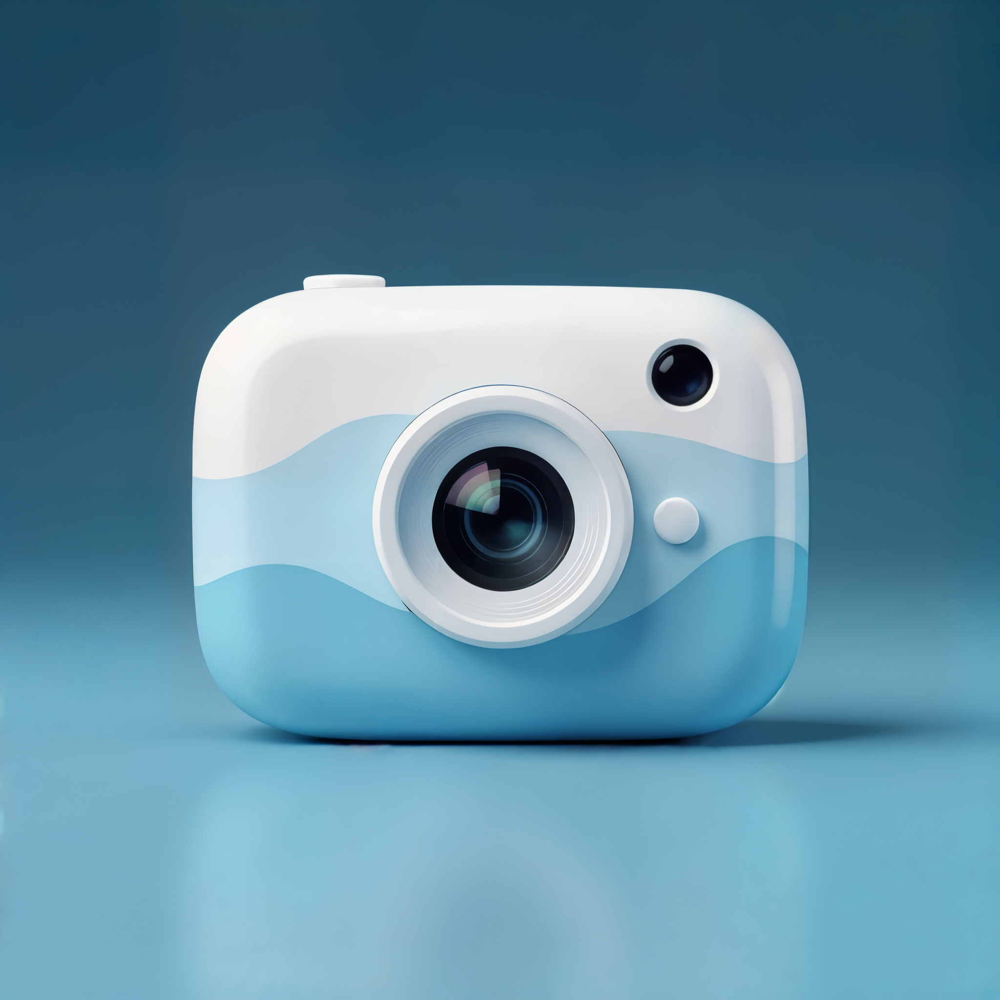

# 


<h1 align="center">CameraThing</h1>
<p align="center">A lightweight camera bubble application for Windows, similar to Loom's camera feature. CameraThing provides a floating, circular camera overlay that stays on top of your screen for video calls, recordings, or presentations.</p>
<p align="center">
  <a href="#features">Features</a> •
  <a href="#installation">Install</a> •
  <a href="#usage">Usage</a>
</p>


## Features


- 🎥 **Floating Camera Bubble**: Circular camera overlay that stays on top of all windows
- 🔄 **Draggable Window**: Move the camera bubble anywhere on your screen
- ⚙️ **Settings Panel**: Configure camera options (more shapes coming soon)
- 🎯 **Transparent Background**: Clean, professional look
- 📐 **Resizable [Coming Soon]**: Adjust the size of the camera bubble to your needs by right clicking on the window.
- 🖥️ **Windows Integration**: Designed specifically for Windows 10 and 11

**Star ⭐ this repository if you find it useful!**

## Installation

Only Windows is supported. You can download it and install it using ClickOnce [here](https://hegde-atri.github.io/CameraThing/CameraThing.application).

It will automatically detect and prompt for updates.


> [!NOTE]
> You will also need to install .NET 9.0 Desktop Runtime which you can install here - https://dotnet.microsoft.com/en-us/download/dotnet/9.0. 

### Option 2: Build from Source

```powershell
# Clone the repository
git clone https://github.com/hegde-atri/CameraThing.git
cd CameraThing

# Build the project
dotnet build --configuration Release

# Run the application
dotnet run --project CameraThing
```

## Usage

1. **Launch**: Search for "CameraThing" in your Start menu or run `CameraThing.exe` from the build output directory
2. **Camera Bubble**: A circular camera overlay will appear on your screen
3. **Move**: Click and drag the bubble to reposition it anywhere on your screen
4. **Resize**: Drag whilst holding right-click to resize the camera bubble
5. **Settings**: Hover over the bubble to reveal the settings button (the three dots). Use this to toggle the settings panel.
6. **Close**: Use the settings panel to exit

## Technology Stack

- **Framework**: WPF
- **Media Handling**: WPFMediaKit for camera integration
- **Target Platform**: .NET 9.0 on Windows

## Contributing

Contributions are welcome! Here's how you can help:

1. **Fork** the repository
2. **Create** a feature branch (`git checkout -b feature/amazing-feature`)
3. **Commit** your changes (`git commit -m 'Add some amazing feature'`)
4. **Push** to the branch (`git push origin feature/amazing-feature`)
5. **Open** a Pull Request

### Development Setup

```powershell
# Prerequisites
# - Visual Studio 2022 or Visual Studio Code
# - .NET 9.0 SDK
# - Windows 10/11

# Clone and setup
git clone https://github.com/hegde-atri/CameraThing.git
cd CameraThing
dotnet restore
```

## Known Issues

- Currently tested primarily on Windows 11

## Roadmap

- [X] Multiple camera source support
- [X] Fix crash when just closing the camera selector toolbar
- [X] Auto Update and installer
- [X] Resizable camera bubble
- [ ] Custom shapes (square, rounded rectangle)
- [ ] Virtual background support
- [ ] Hotkey support

## Licence

This project is licensed under the AGPL License - see the [LICENCE](LICENCE) file for details.

## Acknowledgments

- Built with [WPFMediaKit](https://github.com/jerometerry/wpfmediakit) for camera handling.
- Thanks to [Jan Jones](https://github.com/jjonescz) for his blog post on [ClickOnce Installer](https://janjones.me/posts/clickonce-installer-build-publish-github/).
- Inspired by Loom's camera bubble feature.
- Generative AI was used to create the logo.

## Support

If you encounter any issues or have questions:

1. Check the [Issues](https://github.com/hegde-atri/CameraThing/issues) page
2. Create a new issue with detailed information about your problem
3. Include your Windows version, camera details, and steps to reproduce the issue