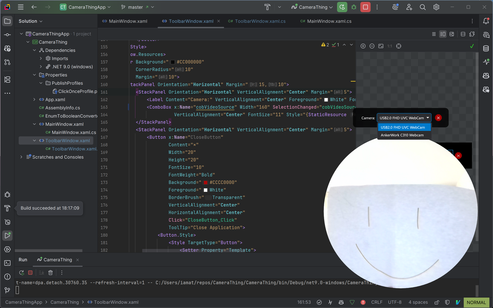
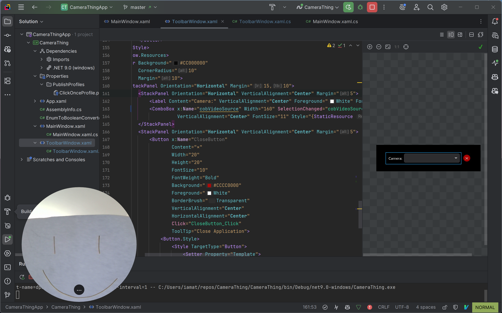

# CameraThing

A lightweight camera bubble application for Windows, similar to Loom's camera feature. CameraThing provides a floating, circular camera overlay that stays on top of your screen for video calls, recordings, or presentations.


## Features




- 🎥 **Floating Camera Bubble**: Circular camera overlay that stays on top of all windows
- 🔄 **Draggable Window**: Move the camera bubble anywhere on your screen
- ⚙️ **Settings Panel**: Configure camera options and appearance
- 🎯 **Transparent Background**: Clean, professional look
- 📐 **Resizable [Coming Soon]**: Adjust the size of the camera bubble to your needs
- 🖥️ **Windows Integration**: Designed specifically for Windows 10 and 11

## System Requirements

- **Operating System**: Windows 10 or Windows 11 (tested on Windows 11)
- **Framework**: .NET 9.0 Runtime
- **Hardware**: Webcam or compatible camera device

## Installation

### Option 1: Download Pre-built Release (Recommended)

1. Go to the [latest release](https://github.com/hegde-atri/CameraThing/releases/latest)
2. Download the `CameraThing.exe` file from the release assets
3. Run the executable - no installation required!

### Option 2: Build from Source

```powershell
# Clone the repository
git clone https://github.com/hegde-atri/CameraThing.git
cd CameraThing

# Build the project
dotnet build --configuration Release

# Run the application
dotnet run --project CameraThing
```

## Usage

1. **Launch**: Double-click `CameraThing.exe` to start the application
2. **Camera Bubble**: A circular camera overlay will appear on your screen
3. **Move**: Click and drag the bubble to reposition it anywhere on your screen
4. **Resize**: Drag the edges to resize the camera bubble
5. **Settings**: Hover over the bubble to reveal the settings button
6. **Close**: Right-click the bubble or use the settings panel to exit

## Technology Stack

- **Framework**: WPF
- **Media Handling**: WPFMediaKit for camera integration
- **Target Platform**: .NET 9.0 on Windows

## Contributing

Contributions are welcome! Here's how you can help:

1. **Fork** the repository
2. **Create** a feature branch (`git checkout -b feature/amazing-feature`)
3. **Commit** your changes (`git commit -m 'Add some amazing feature'`)
4. **Push** to the branch (`git push origin feature/amazing-feature`)
5. **Open** a Pull Request

### Development Setup

```powershell
# Prerequisites
# - Visual Studio 2022 or Visual Studio Code
# - .NET 9.0 SDK
# - Windows 10/11

# Clone and setup
git clone https://github.com/hegde-atri/CameraThing.git
cd CameraThing
dotnet restore
```

## Known Issues

- Currently tested primarily on Windows 11

## Roadmap

- [X] Multiple camera source support
- [X] Fix crash when just closing the camera selector toolbar
- [ ] Custom shapes (square, rounded rectangle)
- [ ] Virtual background support
- [ ] Hotkey support
- [ ] Auto Update and installer

## License

This project is licensed under the AGPL License - see the [LICENCE](LICENCE) file for details.

## Acknowledgments

- Built with [WPFMediaKit](https://github.com/jerometerry/wpfmediakit) for camera handling
- Inspired by Loom's camera bubble feature

## Support

If you encounter any issues or have questions:

1. Check the [Issues](https://github.com/hegde-atri/CameraThing/issues) page
2. Create a new issue with detailed information about your problem
3. Include your Windows version and camera details

---

**Star ⭐ this repository if you find it useful!**
